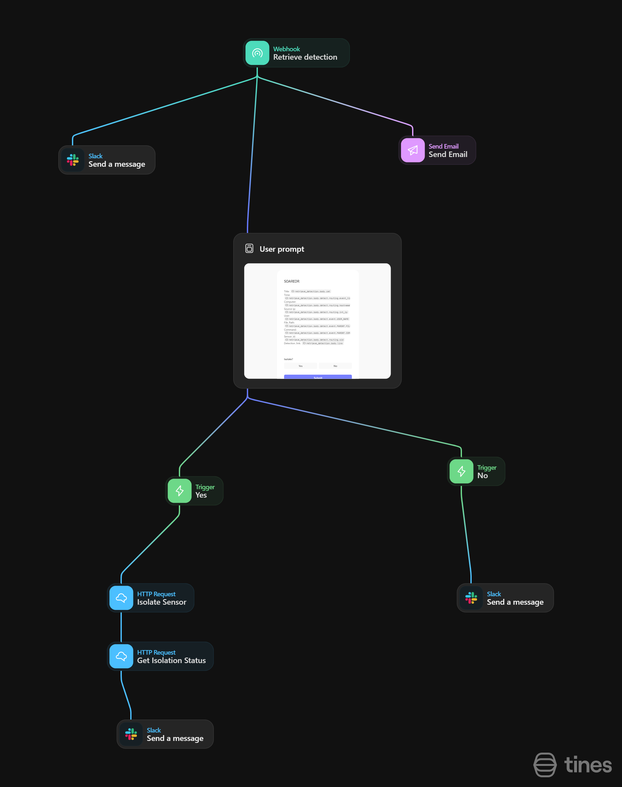

# 🛡️ SOAR-EDR Automation Platform

An advanced Security Orchestration, Automation, and Response (SOAR) platform integrated with LimaCharlie EDR, featuring automated detection, isolation, and response capabilities.

## 🌟 Features

- **Real-time Threat Detection**: Automated monitoring and detection of security threats using LimaCharlie EDR
- **Smart Isolation Protocol**: User-prompted isolation decisions for infected machines
- **Slack Integration**: Instant alerts and notifications through Slack channels
- **Automated Response Actions**: Predefined response playbooks for common threats
- **LaZagne Attack Detection**: Specialized detection rules for credential dumping attempts

## 🏗️ Architecture

### Components
- **LimaCharlie EDR**: Endpoint detection and response
- **Tines**: Automation and orchestration platform
- **Slack**: Alert notifications and user interaction

### Workflow
1. Threat Detection
   - LimaCharlie EDR monitors endpoints
   - Custom detection rules identify suspicious activities
   - LaZagne credential dumping attempts are flagged
   

2. Alert Processing
   - Tines receives detection alerts
   - Automated workflow triggers response actions
   - Slack notifications are generated

3. User Interaction
   - Security team receives Slack alerts
   - Option to isolate infected machines
   - Automated response based on user decision

## 🔍 LaZagne Detection Rule

```yaml
- action: report
  metadata:
    name: Lazagne Detected
    description: Detects LaZagne (SOAR-EDR Tool)
    falsepositives:
      - To_be_added
    level: medium
    tags:
      - attack.credential_access
```

## 🚀 Getting Started

1. **Prerequisites**
   - LimaCharlie EDR account and sensors installed
   - Tines instance configured
   - Slack workspace with appropriate channels

2. **Installation**
   ```bash
   # Clone the repository
   git clone https://github.com/yourusername/soar-edr
   ```

3. **Configuration**
   - Set up LimaCharlie EDR sensors
   - Import Tines workflow
   - Configure Slack integration

## 🔧 Configuration

### LimaCharlie EDR
```yaml
detection:
  rules:
    - name: lazagne_detection
      path: events/PROCESS
      target: windows
```

### Tines Integration
1. Import the provided workflow
2. Configure the following agents:
   - Malware Detection
   - Alert Processing
   - User Prompt
   - Isolation Handler
   - Message Dispatcher
   


## 🤝 Contributing

We welcome contributions! Please follow these steps:
1. Fork the repository
2. Create a feature branch
3. Commit your changes
4. Push to the branch
5. Open a Pull Request

## 📜 License

This project is licensed under the MIT License - see the [LICENSE](LICENSE) file for details.

## 🔐 Security

- Report security vulnerabilities to your own email @
- Follow responsible disclosure practices
- Regular security assessments recommended

## 📞 Support

For support:
- Open an issue in the repository
- Contact the security team via Slack
- Check documentation in the `/docs` folder

## 🎯 Roadmap

- [ ] Additional EDR integrations
- [ ] Enhanced automated response playbooks
- [ ] Machine learning-based detection rules
- [ ] Advanced reporting dashboard
- [ ] Multi-tenant support

## 🏆 Acknowledgments

- LimaCharlie EDR team
- Tines automation platform
- Security community contributors
